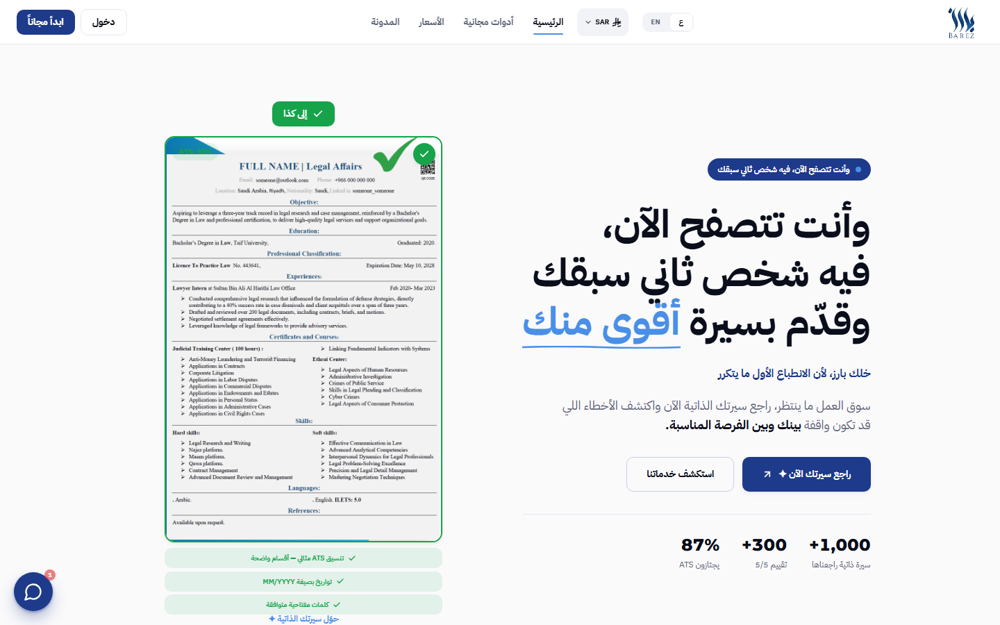
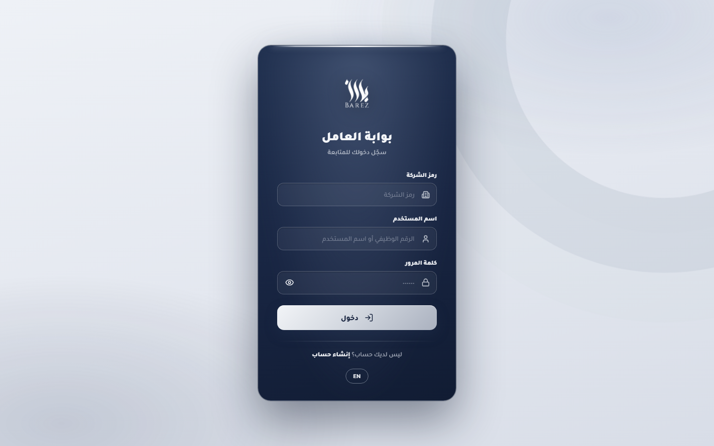

# معرض الأعمال — عبدالرحيم عبيد

أساعد الشركات على خفض تكاليف الموارد البشرية ورفع أداء موظفيها: أنظمة تؤتمت عمليات القسم، ومؤشرات أداء تُحسب من بيانات التشغيل.

| [بارز أفراد](#بارز-أفراد--barezzcom) | [بارز أعمال](#بارز-أعمال--نظام-الموارد-البشرية) | [لوحة Power BI](#لوحة-الموارد-البشرية--power-bi) | [نظام المؤشرات](#نظام-مؤشرات-الأداء) | [نظام HR](#نظام-hr-المتكامل--excel) |
|---|---|---|---|---|

---

## بارز أفراد — barezz.com

منصة مراجعة وتحسين سير ذاتية بالذكاء الاصطناعي، بالعربية ولسوق العمل السعودي والخليجي. تحلل السيرة وتكشف ما يُسقطها لدى أنظمة فرز المتقدمين (ATS)، ثم تعيد صياغتها بما يرفع توافقها مع الوظيفة المستهدفة. تشمل نظام اشتراكات ودفع كاملاً.

| الحالة | بنيتها | التقنيات | الكود |
|--------|--------|----------|-------|
| تعمل وتخدم عملاء — [barezz.com](https://barezz.com) | من الصفر: تصميماً وتطويراً وتشغيلاً | Next.js · TypeScript · Supabase · Claude API | خاص — [صفحة التفاصيل](https://github.com/ab1ob/barez-cv-platform-overview) |

---

## بارز أعمال — نظام الموارد البشرية

نظام HRIS متعدد الشركات بعزل كامل للبيانات، يغطي دورة حياة الموظف: رواتب متعددة العملات بمسيرات متعددة داخل السعودية وخارجها، حضور بتحقق متعدد العوامل، مسار توظيف من الإعلان إلى التعيين، إجازات وعُهد وسلف وخطابات بدورات اعتماد موثقة، وتقارير قرارية لكل مستوى إداري.

| الحالة | بنيته | التقنيات | الكود |
|--------|--------|----------|-------|
| يعمل ويخدم شركات — barez.sa (قيد الربط) | من الصفر: تصميماً وتطويراً وتشغيلاً | Python · Flask · SQLite | خاص — [صفحة التفاصيل](https://github.com/ab1ob/barez-erp-overview) |

---

## لوحة الموارد البشرية — Power BI

سبع صفحات تغطي دورة حياة الموظف: ملخص تنفيذي بنِسَب السعودة والدوران، قمع توظيف لـ21,000 طلب من التقديم إلى التعيين، رواتب وتدريب وحضور وإجازات وعُهد. النموذج: 12 جدولاً و15 علاقة و23 مقياس DAX بالعربي، بصيغة PBIP/TMDL المفتوحة القابلة للقراءة والمقارنة.

| متاح للجميع | التقنيات | |
|--------------|----------|---|
| بيانات تجريبية لألف موظف — [الريبو](https://github.com/ab1ob/barez-hr-powerbi-dashboard) | Power BI · DAX · Power Query · TMDL | [⬇️ تحميل](https://github.com/ab1ob/barez-hr-powerbi-dashboard/archive/refs/heads/master.zip) |

---

## نظام مؤشرات الأداء

لوحة قيادة ودليل مؤشرات موثّق لخمسة أقسام: التسويق والمبيعات، استقطاب المواهب، التعلم والتطوير، نجاح العملاء، وتطوير البرمجيات. القاعدة الصارمة فيه: المؤشر يُعرَّف من المخرجات والأثر — التوثيق والالتزام الإداري شرط جودة، لا أداء يُكافأ.

| متاح للجميع | التقنيات | |
|--------------|----------|---|
| [الريبو](https://github.com/ab1ob/barez-kpi-system) | Excel | [⬇️ تحميل](https://github.com/ab1ob/barez-kpi-system/archive/refs/heads/master.zip) |

---

## نظام HR المتكامل — Excel

نظام تشغيلي كامل في ملف واحد للمنشآت الصغيرة والمتوسطة: لوحة تحكم، سجل موظفين، حضور، مسير رواتب بحسابات تلقائية، إجازات، خصومات ومكافآت، ومؤشرات أداء لكل موظف — مع حسابات التأمينات الاجتماعية (GOSI) ومكافأة نهاية الخدمة ومتابعة انتهاء الإقامات وفق الأنظمة السعودية.

| متاح للجميع | التقنيات | |
|--------------|----------|---|
| بيانات تجريبية لثلاثين موظفاً — [الريبو](https://github.com/ab1ob/hr-excel-system) | Excel (معادلات وأتمتة) | [⬇️ تحميل](https://github.com/ab1ob/hr-excel-system/archive/refs/heads/master.zip) |

---

[الصفحة الرئيسية](https://github.com/ab1ob) · [LinkedIn](https://www.linkedin.com/in/abdulrahim-obaid-273055298) · [barezz.com](https://barezz.com)

